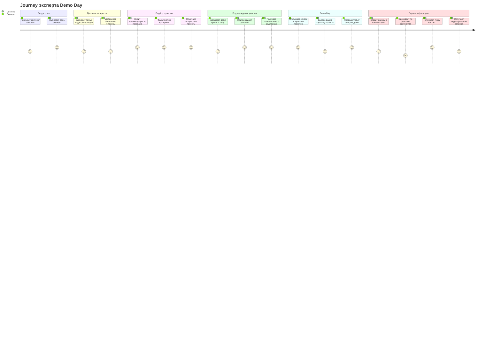

# User Journey Map: AI-first Unconference Navigator

> Персона: Эксперт Demo Day  
> Цель: быстро найти релевантные проекты, подтвердить участие (дата/время/тема), провести содержательное Q&A и дать оценку с возможностью фоллоу‑апа  
> Основано на: Brief v1, User Story Map v1

---

## Диаграмма

---

## Анализ по фазам

### Вход и роль

| Действие | Score | Почему такая оценка | Pain Points |
|----------|-------|---------------------|-------------|
| Понимает контекст события | 3 | Контекст может быть неочевиден при высокой плотности программы | Требуется быстрое объяснение ценности |
| Выбирает роль "эксперт" | 4 | Простое действие, влияет на релевантность | Риск неверного выбора роли |

**Что думает пользователь:** "Хочу быстро понять, чем я могу быть полезен и где мой вклад важен."

---

### Профиль интересов

| Действие | Score | Почему такая оценка | Pain Points |
|----------|-------|---------------------|-------------|
| Выбирает темы/индустрии/стадии | 3 | Требуется время на выбор | Может быть сложно быстро сузить интересы |
| Добавляет свободные интересы | 3 | Полезно, но требует формулировок | Риск неполных/размытых интересов |

**Что думает пользователь:** "Я не хочу тратить много времени на настройку, но хочу точные рекомендации."

---

### Подбор проектов

| Действие | Score | Почему такая оценка | Pain Points |
|----------|-------|---------------------|-------------|
| Видит рекомендации по профилю | 4 | Дает быстрый старт | Качество зависит от профиля |
| Фильтрует по критериям | 4 | Прозрачный контроль релевантности | Может быть много вариантов |
| Отмечает интересные проекты | 4 | Простое действие, усиливает фокус | Нет |

**Что думает пользователь:** "Супер, есть понятный список — могу выбрать лучшее."

---

### Подтверждение участия

| Действие | Score | Почему такая оценка | Pain Points |
|----------|-------|---------------------|-------------|
| Указывает дату/время и тему | 3 | Требует согласования с графиком | Риск неточности/поспешности |
| Подтверждает участие | 4 | Логичный шаг | Нет |
| Получает напоминание о дедлайнах | 4 | Помогает не забыть | Нет |

**Что думает пользователь:** "Главное — быстро подтвердить и не пропустить сроки."

---

### Demo Day

| Действие | Score | Почему такая оценка | Pain Points |
|----------|-------|---------------------|-------------|
| Открывает список выбранных проектов | 4 | Быстро возвращается к выбору | Нет |
| Быстро видит карточку проекта | 3 | Нужна лаконичность | Риск лишней информации |
| Проводит Q&A/смотрит демо | 4 | Ценность события проявляется | Нет |

**Что думает пользователь:** "Нужно быстро вспомнить контекст и задать хорошие вопросы."

---

### Оценка и фоллоу‑ап

| Действие | Score | Почему такая оценка | Pain Points |
|----------|-------|---------------------|-------------|
| Ставит оценку и комментарий | 3 | Требует времени после сессии | Усталость в конце дня |
| Оценивает по трековым критериям | 2 | Сложность критериев, разный трек | Риск непоследовательности |
| Отмечает "хочу контакт" | 4 | Простой сигнал интереса | Нет |
| Получает подтверждение запроса | 3 | Полезно, но не всегда критично | Может не увидеть результата |

**Что думает пользователь:** "Хочу оценить быстро и не запутаться в критериях."

---

## Выявленные проблемы

### Критические (Score 1-2)

| # | Фаза | Действие | Проблема | Влияние |
|---|------|----------|----------|---------|
| 1 | Оценка и фоллоу‑ап | Оценка по трековым критериям | Сложно быстро применить разные критерии | Снижается качество и полнота оценки |

### Gaps в User Story Map

| # | Что отсутствует | Где должно быть | Рекомендация |
|---|-----------------|-----------------|--------------|
| 1 | Быстрое уточнение профиля интересов | Профиль интересов | Добавить историю про корректировку интересов после первых рекомендаций |
| 2 | Подсказки по критериям оценки | Оценка | Добавить историю про краткие подсказки/примеры по трековым критериям |

---

## Рекомендации по доработке USM

### Приоритет 1 (Критично)
- [ ] **Оценка:** добавить story о подсказках по трековым критериям, чтобы эксперты оценивали последовательно

### Приоритет 2 (Важно)
- [ ] **Профиль интересов:** добавить story о быстром уточнении интересов после первых рекомендаций

### Приоритет 3 (Улучшение)
- [ ] **Фоллоу‑ап:** добавить story о кратком подтверждении статуса запроса на контакт

---

## Метрики

- **Средний score:** 3.5 / 5
- **Критических точек (score ≤ 2):** 1
- **Самая слабая фаза:** Оценка и фоллоу‑ап (avg: 3.0)
- **Самая сильная фаза:** Подбор проектов (avg: 4.0)

---

## Следующие шаги

1. [ ] Обсудить критическую проблему с оценкой по трекам
2. [ ] Обновить User Story Map
3. [ ] Пересмотреть journey после обновления USM
