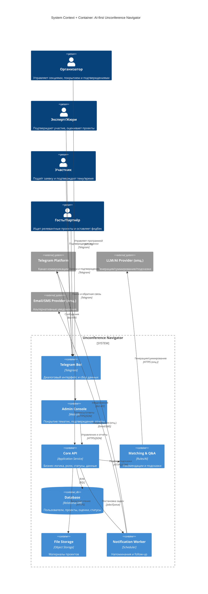

# C4 Architecture: AI-first Unconference Navigator

> Версия: 1.0  
> Дата: 1 февраля 2026  
> Основано на: Brief v1, USM v1, NFR v1

## 1. Обзор системы

**Назначение:** AI‑куратор Demo Day, который помогает ролям (организаторы, эксперты, участники, гости) находить релевантные проекты, подтверждать участие, получать напоминания и собирать обратную связь/фоллоу‑ап.  
**Ключевые пользователи:** организатор/модератор, эксперт/жюри, участник проекта, гость/партнёр.  
**Внешние зависимости:** Telegram Platform, (опц.) LLM/AI Provider, (опц.) Email/SMS provider.

## 2. Архитектурная диаграмма

## 3. Описание компонентов

### Контейнеры

| Контейнер | Технология | Назначение | Масштабирование |
|---|---|---|---|
| Telegram Bot | Telegram | Диалоговый интерфейс для всех ролей | Горизонтально при росте нагрузки |
| Admin Console | Web UI | Контроль покрытий, подтверждений, отчётов | Горизонтально по числу орг‑пользователей |
| Core API | Application Service | Бизнес‑логика, роли, статусы, данные | Горизонтально |
| Matching & Q&A | Rules/AI | Рекомендации, подсказки для Q&A | Горизонтально/по требованию |
| Database | Relational DB | Хранение пользователей, проектов, оценок | Вертикально + репликация |
| File Storage | Object Storage | Материалы проектов | Масштабируется по объёму |
| Notification Worker | Scheduler | Напоминания и follow‑up | Горизонтально по очереди задач |

### Внешние системы

| Система | Назначение | Интеграция | Fallback |
|---|---|---|---|
| Telegram Platform | Канал коммуникации | Bot API | Нет (основной канал) |
| LLM/AI Provider (опц.) | Генерация/суммирование | HTTPS API | Правила/шаблоны без AI |
| Email/SMS Provider (опц.) | Альтернативные уведомления | API | Только Telegram |

## 4. Потоки данных

### Основной поток
Пользователь → Telegram Bot / Admin Console → Core API → Database / File Storage → Ответ пользователю.

### Асинхронные операции
Core API → Notification Worker → Telegram Platform / Email/SMS Provider.

## 5. Ключевые решения

| Решение | Выбор | Почему | Альтернативы |
|---|---|---|---|
| Канал для пользователей | Telegram‑first | Быстрый доступ и привычный канал | Отдельное приложение / веб‑кабинет |
| Роль‑ориентированный UX | Да | Разные сценарии у организаторов/экспертов/участников | Единый сценарий |
| AI‑подсказки | Опционально | Повышают качество Q&A и подбора | Статические шаблоны |
| Напоминания через воркер | Да | Устойчивость к пикам и дедлайнам | Синхронные отправки |

## 6. Нерешённые вопросы

- [ ] Нужны ли интеграции с календарями для 1:1 встреч?
- [ ] Требуется ли email‑канал как резервный?
- [ ] Политика хранения материалов и оценок (сроки).
