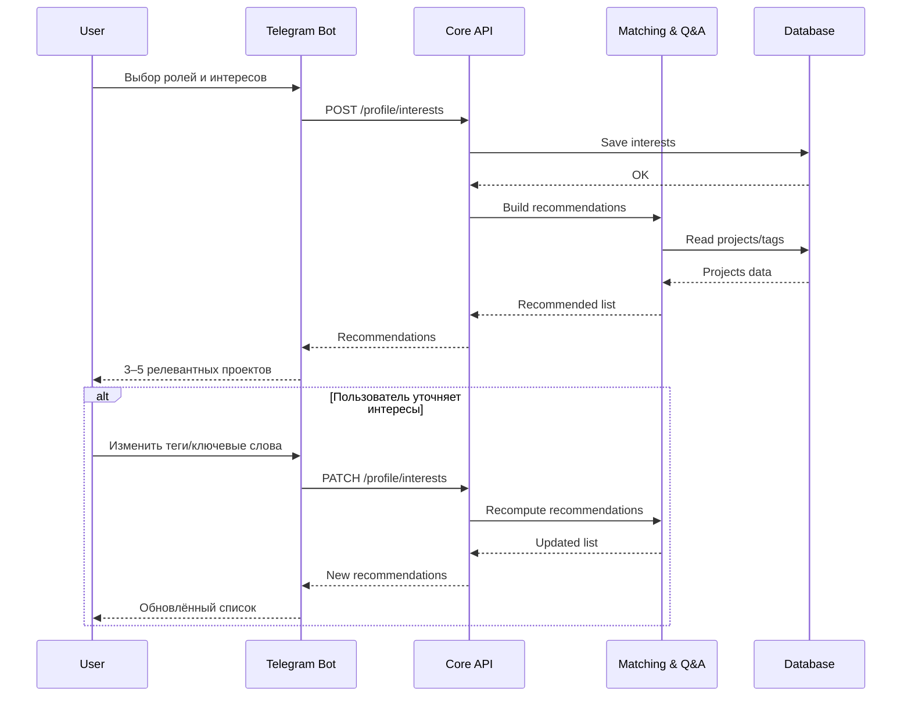
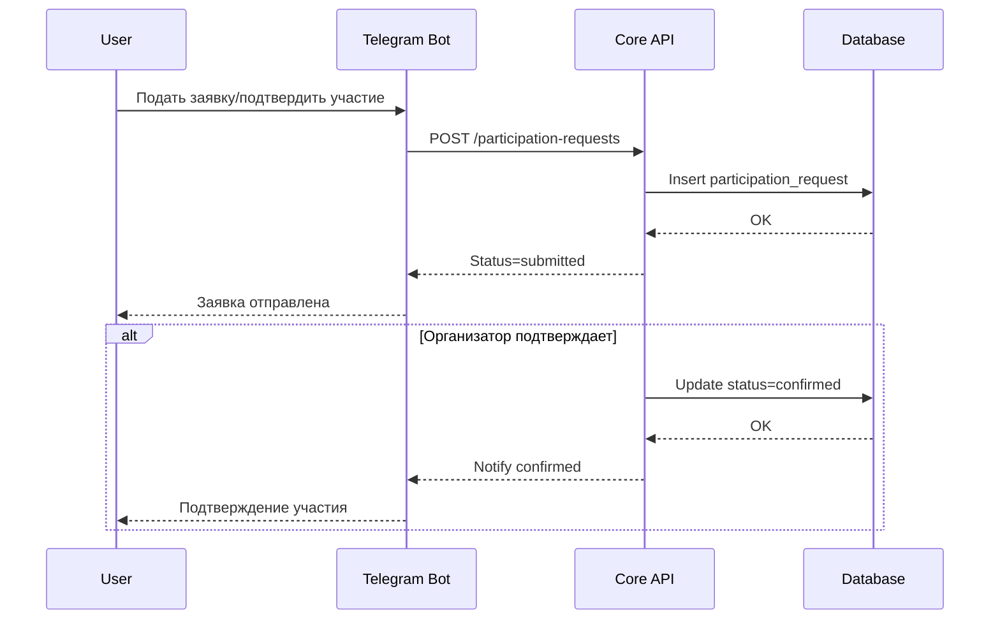
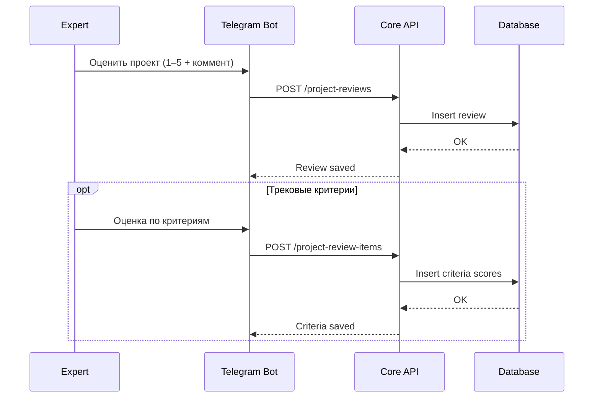
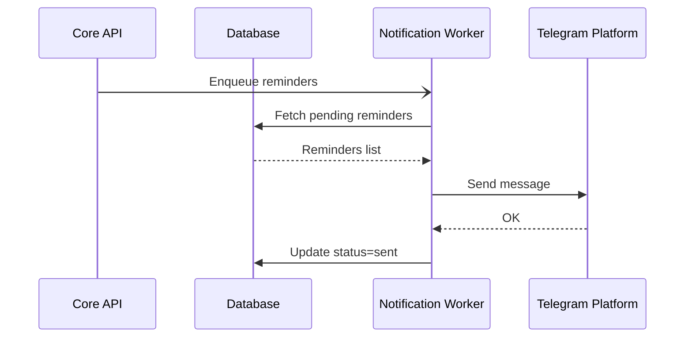
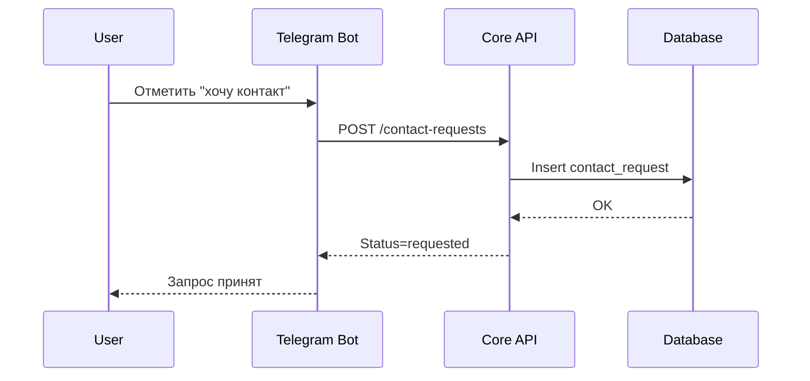

# Sequence Diagrams: AI-first Unconference Navigator

> Основано на: USM v1, C4 v1, ER v1

## Обзор

| # | Сценарий | Сложность | Участники |
|---|----------|-----------|-----------|
| 1 | Профиль интересов + рекомендации | Средняя | User, Telegram Bot, Core API, Matching, DB |
| 2 | Подтверждение участия (эксперт/участник) | Средняя | User, Telegram Bot, Core API, DB |
| 3 | Оценка проекта + критерии | Средняя | User, Telegram Bot, Core API, DB |
| 4 | Напоминания о дедлайнах (async) | Средняя | Worker, Core API, Telegram, DB |
| 5 | Follow‑up «хочу контакт» | Низкая | User, Telegram Bot, Core API, DB |
| 6 | Роль организатора по приглашению | Средняя | User, Telegram Bot, Core API, DB |

---

## 1. Профиль интересов + рекомендации

### Контекст

**User Story:** US-003, US-004, US-004a, SS-002, SS-003  
**Участники:** Пользователь, Telegram Bot, Core API, Matching, DB

### Диаграмма



### Примечания
- Пересчёт рекомендаций должен быть быстрым (пик 100 пользователей).

---

## 2. Подтверждение участия (эксперт/участник)

### Контекст

**User Story:** US-008, US-009, US-010, SS-004  
**Участники:** Пользователь, Telegram Bot, Core API, DB

### Диаграмма



### Примечания
- В MVP статусы: submitted → confirmed.

---

## 3. Оценка проекта + критерии

### Контекст

**User Story:** US-014, US-015, US-015a  
**Участники:** Эксперт, Telegram Bot, Core API, DB

### Диаграмма



### Примечания
- Подсказки по критериям показываются в боте перед оценкой.

---

## 4. Напоминания о дедлайнах (async)

### Контекст

**User Story:** SS-005, SS-007  
**Участники:** Core API, Worker, DB, Telegram

### Диаграмма



### Примечания
- В день события и после — повторная отправка формы обратной связи.

---

## 5. Follow‑up «хочу контакт»

### Контекст

**User Story:** US-017, SS-008  
**Участники:** Пользователь, Telegram Bot, Core API, DB

### Диаграмма



---

## 6. Роль организатора по приглашению\n+\n+### Контекст\n+\n+**User Story:** US-002, SS-001  \n+**Участники:** Пользователь, Telegram Bot, Core API, DB\n+\n+### Диаграмма\n+\n+```mermaid\n+sequenceDiagram\n+    participant U as User\n+    participant B as Telegram Bot\n+    participant A as Core API\n+    participant D as Database\n+\n+    U->>B: Выбирает роль «Организатор»\n+    B->>U: Запрос кода приглашения\n+    U->>B: Вводит код\n+    B->>A: POST /role-invites/accept\n+    A->>D: Validate invite code\n+    D-->>A: Invite valid\n+    A->>D: Assign organizer role\n+    D-->>A: OK\n+    A-->>B: Role assigned\n+    B-->>U: Доступ организатора подтверждён\n+\n+    alt Кода нет — запрос назначения\n+        U->>B: Запросить доступ\n+        B->>A: POST /access-requests\n+        A->>D: Save access request\n+        D-->>A: OK\n+        A-->>B: Request received\n+        B-->>U: Ожидайте назначения\n+    end\n+```\n+\n+### Примечания\n+- Назначение админом может происходить вне бота; уведомление приходит через Telegram.\n+\n+---\n+\n ## Приложения
## Приложения

### Участники (из C4)

| ID | Название | Тип | Описание |
|---|---|---|---|
| User | Пользователь | Actor | Организатор/эксперт/участник/гость |
| Telegram Bot | Container | UI | Диалоговый интерфейс |
| Core API | Container | Service | Бизнес‑логика |
| Matching & Q&A | Container | Service | Рекомендации и подсказки |
| Database | ContainerDb | Data | Основные данные |
| Notification Worker | Container | Async | Напоминания |
| Telegram Platform | System_Ext | External | Канал сообщений |

### Соглашения

- `->>` / `-->>` — синхронные
- `-)` / `--)` — асинхронные
- `-x` — ошибка
