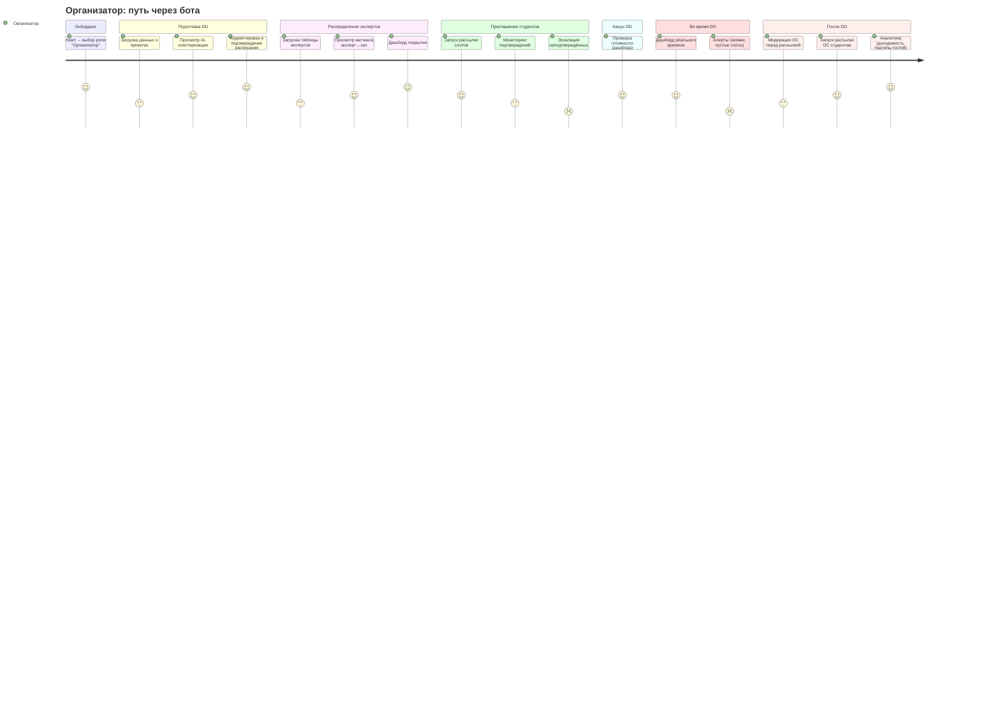
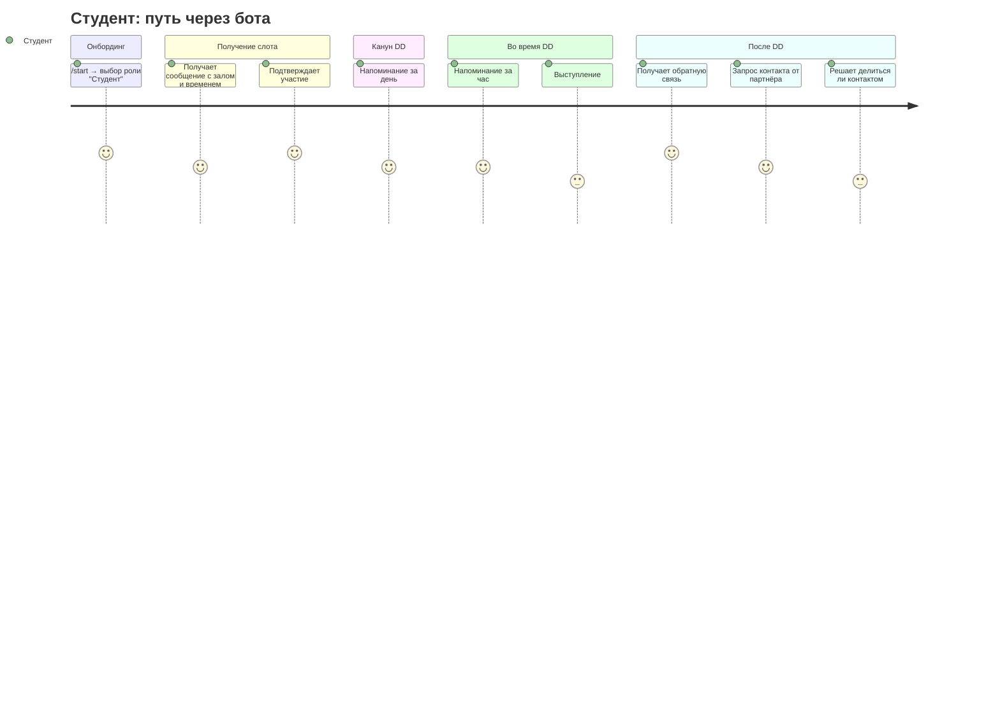
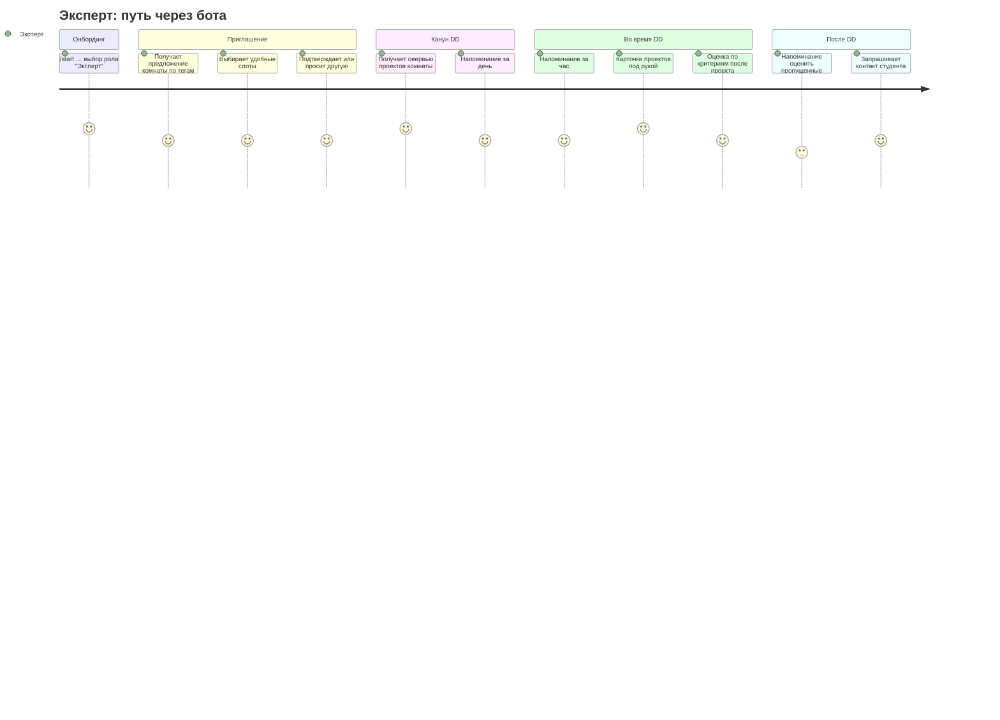
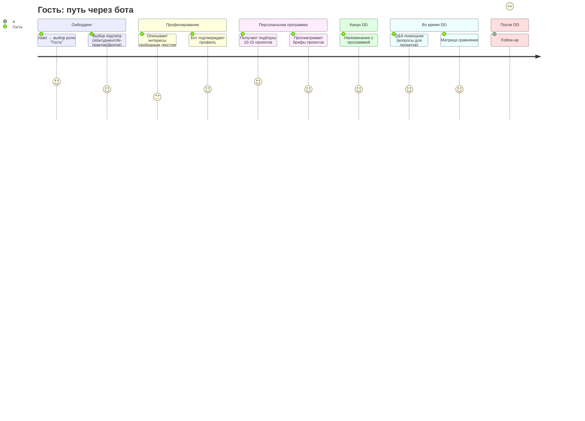
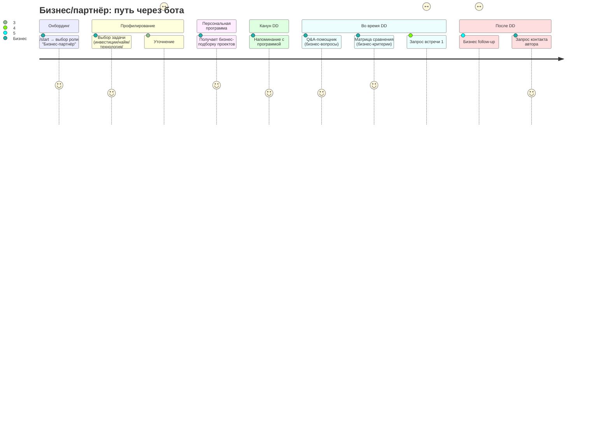

# User Journey Map: AI-агент-куратор DemoDay

> **Версия:** 1.0
> **Дата:** 2026-02-01
> **На основе:** Brief v3.0, USM v2.0, Customer Journeys (discovery)
> **Отличие от discovery:** здесь — путь пользователя **через бот**, а не общий процесс DD

---

## 1. Организатор

### Journey Diagram



### Детали по этапам

| Этап | Действие в боте | Экран/UX | Эмоция | Pain point | Связь с USM |
|------|----------------|----------|--------|------------|-------------|
| Онбординг | /start → кнопка "Организатор" | Inline-кнопки 5 ролей | Нейтрально | — | US-001 |
| Загрузка проектов | Отправляет файл или команду /load | Бот подтверждает кол-во, предупреждает о пустых описаниях | Тревога ("а если ошибка?") | Формат файла может быть неожиданным | US-003 |
| AI-кластеризация | Бот показывает залы с проектами | Список залов, по каждому — проекты + обоснование | Любопытство → облегчение | Непонятно, почему AI так решил | SS-002 |
| Подтверждение расписания | Кнопки: Подтвердить / Перенести / Перегенерировать | Поэтапное подтверждение (зал за залом или всё сразу) | Контроль | Если расписание плохое — пересоздание долгое | US-004 |
| Загрузка экспертов | Отправляет файл или команда /experts | Бот: "Загружено 76 экспертов с тегами" | Нейтрально | Для демо — предзагружено | US-006 |
| Дашборд покрытия | Команда /coverage | Залы: покрыт / частично / не покрыт | Тревога, если красный | Что делать если зал не покрыт? | US-008 |
| Рассылка слотов | Команда /notify_students | Бот рассылает, показывает прогресс | Облегчение | Telegram rate limits (30 msg/s) | SS-003 |
| Мониторинг подтверждений | Команда /confirmations | Список: подтвердили / не ответили / отказались | Тревога | "80 не ответили" | SS-004 |
| Дашборд реального времени | Команда /dashboard | Кто пришёл, пустые слоты, покрытие | Стресс (день DD) | Информация запаздывает если нет чекина | US-017 |
| Модерация ОС | Бот показывает оригинал + AI-версию | Кнопки: Отправить / Редактировать / Отклонить | Ответственность | Много ОС на модерацию | US-018 |
| Аналитика | Команда /analytics | Доходимость, покрытие, NPS, подтипы гостей | Удовлетворение | — | US-017 |

---

## 2. Студент

### Journey Diagram



### Детали по этапам

| Этап | Действие в боте | Экран/UX | Эмоция | Pain point | Связь с USM |
|------|----------------|----------|--------|------------|-------------|
| Онбординг | /start → "Студент" | Inline-кнопки | Нейтрально | — | US-001 |
| Получение слота | Входящее сообщение от бота | "Ты выступаешь [дата], Зал [X], [время]" | Облегчение ("наконец-то знаю") | Слот неудобный — нет механизма замены | SS-003 |
| Подтверждение | Кнопки: Подтверждаю / Не смогу | При "Не смогу" — поле причины | Ответственность | Давление ("а если не приду?") | US-005 |
| Напоминание за день | Входящее сообщение | "Завтра, Зал 3, 14:15. Эксперты: ..." | Мотивация | — | SS-008 |
| Напоминание за час | Входящее сообщение | "Через час — твоё выступление" | Волнение | — | SS-008 |
| Получение ОС | Входящее сообщение | Сгруппировано: что хорошо / улучшить / техническое | Волнение → облегчение | "А вдруг разнесут?" (AI фильтрует) | SS-011 |
| Запрос контакта | Входящее сообщение | "Партнёр [роль] хочет связаться" + кнопки | Интерес / настороженность | Не знает кто этот партнёр | US-021, US-016 |

---

## 3. Эксперт

### Journey Diagram



### Детали по этапам

| Этап | Действие в боте | Экран/UX | Эмоция | Pain point | Связь с USM |
|------|----------------|----------|--------|------------|-------------|
| Онбординг | /start → "Эксперт" | Inline-кнопки | Нейтрально | — | US-001 |
| Приглашение | Входящее сообщение | "По вашим интересам (NLP, Agents) → Зал 3. Проекты: ... Какие слоты удобны?" | Интерес | Теги не точные → нерелевантная комната | US-007 |
| Выбор слотов | Inline-кнопки со слотами | Эксперт выбирает удобные временные окна | Контроль ("могу совместить с работой") | Слишком мелкие слоты — неудобно | US-007 |
| Подтверждение | Кнопки: Иду / Другую / Не смогу | При "Другую" — список альтернативных залов | Контроль | — | US-007 |
| Овервью | Входящее сообщение (за 1 день) | Карточки: название, описание, стек, GitHub, артефакты | Вовлечённость ("знаю, что ожидать") | Много проектов — длинное сообщение | SS-009 |
| Оценка | Бот после каждого проекта | Оценка по критериям + комментарий. Пропущенные студенты автотрекаются | Фокус (сразу после проекта) | "Если много сообщений — неудобно" → упаковать в пару | US-019 |
| Напоминание оценить | Через день, если не оценил | "Ты ещё не оценил 5 проектов" | Раздражение | Не хочет, но нужно | US-019 |

---

## 4. Гость (Абитуриент / AI-практик / Другое)

### Journey Diagram



### Детали по этапам

| Этап | Действие в боте | Экран/UX | Эмоция | Pain point | Связь с USM |
|------|----------------|----------|--------|------------|-------------|
| Онбординг | /start → "Гость" | Inline-кнопки 5 ролей | Нейтрально | — | US-001 |
| Подтип | Кнопки: Абитуриент / AI-практик / Другое | Второй экран после роли | Нейтрально | "Зачем это?" (нужен пояснительный текст) | US-002 |
| Профилирование | Свободный текст | "Расскажите, что вас интересует на DD" | Нерешительность ("что написать?") | Может написать слишком мало/много | US-009 |
| Подтверждение профиля | Бот показывает извлечённые интересы | "Вас интересует: NLP, Agents, EdTech. Верно?" + кнопки | Удивление ("понял!") | AI неправильно понял | US-009 |
| Подборка проектов | Входящее сообщение | 10-15 проектов: название, описание, зал, время, релевантность | Вау-эффект | Слишком много информации | SS-006 |
| Брифы | По запросу — детальнее по проекту | 2-3 предложения, теги, автор, зал/время | Вовлечённость | — | US-010 |
| Q&A-помощник | По запросу или автоматически | 3-5 вопросов под профиль | Уверенность ("знаю что спросить") | Вопросы поверхностные | US-012 |
| Матрица сравнения | По запросу | Таблица: проект × критерий | Аналитичность | Критерии могут не совпадать с нужными | US-014 |
| Follow-up | Входящее (после DD) | Конспект, рекомендации, next steps | Благодарность | — | SS-012 |

---

## 5. Бизнес/партнёр

### Journey Diagram



### Детали по этапам

| Этап | Действие в боте | Экран/UX | Эмоция | Pain point | Связь с USM |
|------|----------------|----------|--------|------------|-------------|
| Онбординг | /start → "Бизнес-партнёр" | Inline-кнопки 5 ролей | Деловой настрой | — | US-001 |
| Задача | Кнопки: Инвестиции / Найм / Технология / Партнёрство | Структурированный выбор | Фокус | Может быть несколько задач | US-011 |
| Уточнение | Кнопки + свободный текст | Отрасль, стек, стадия проекта, формат | Нетерпение ("давай уже проекты") | Слишком много вопросов | US-011 |
| Бизнес-подборка | Входящее сообщение | Проекты с бизнес-фокусом: стадия, команда, бизнес-модель | Деловой интерес | Мало проектов в нише | SS-007 |
| Q&A бизнес | По запросу | Вопросы: unit-экономика, команда, IP, roadmap | Подготовленность | Вопросы не учитывают специфику отрасли | US-013 |
| Матрица сравнения | По запросу | Проект × бизнес-критерий | Аналитичность | — | US-014 |
| Встреча 1:1 | Кнопка "Назначить встречу" | Выбор слота → запрос студенту | Целеустремлённость | Студент может отказать / не ответить | US-015, US-016 |
| Бизнес follow-up | Входящее (после DD) | Конспект + контакты (с согласия) + шаблоны LOI | Удовлетворение | Студент не дал согласие на контакт | SS-013 |
| Запрос контакта | Кнопка "Связаться с автором" | Запрос согласия студенту | Ожидание | Задержка ответа студента | US-020 |

---

## Сводная карта: Роли × Фазы × Эмоции

```
Фаза:        Онбординг   Подготовка   Приглашение   Канун    Во время DD   После DD
             ─────────   ──────────   ───────────   ─────    ──────────    ────────
Организатор  😐 →        😰 → 😊     😰 →          😌      😰 →          😊
             выбор       загрузка,    рассылка,     провер-  дашборд,      аналитика,
             роли        кластериз.   мониторинг    ка       алерты        ОС

Студент      😐 →        —            😊 →          😌      😰 →          😊/😟
             выбор                    слот,         напом.   выступ-       ОС,
             роли                     подтвержд.             ление         контакт

Эксперт      😐 →        —            😊 →          😊      😊 →          😩 → 😊
             выбор                    комната,      оверв.   карточки      оценка,
             роли                     подтвержд.                           контакт

Гость        😐 →        —            😕 → 😊      😌      😊 →          😊
             роль,                    профилир.,    напом.   Q&A,          follow-up
             подтип                   подборка               сравнение

Бизнес       😐 →        —            🎯 → 😊      😌      🎯 →          😊
             выбор                    задача,       напом.   Q&A, 1:1,     LOI,
             роли                     подборка               сравнение     контакты
```

---

## Критические моменты (Moments of Truth)

| # | Момент | Роль | Риск | Митигация |
|---|--------|------|------|-----------|
| 1 | AI-кластеризация показывает результат | Организатор | "Ещё хуже чем ChatGPT" → потеря доверия | Показывать обоснование кластера, давать контроль (перенести, перегенерировать) |
| 2 | Студент видит свой слот | Студент | Слот неудобный, нет механизма замены → негатив | Дать возможность написать причину, эскалировать оргу |
| 3 | Эксперт видит предложенную комнату | Эксперт | Нерелевантная тема → "зачем пришёл?" | Показывать проекты сразу, давать альтернативы |
| 4 | Гость описывает интересы | Гость | Не знает что написать → пустой профиль | Подсказки, примеры, fallback на кнопки тематик |
| 5 | Бизнес-партнёр видит подборку | Бизнес | Нет релевантных проектов в нише → разочарование | Расширять выборку, показывать смежные тематики |
| 6 | Студент получает ОС | Студент | Негативная ОС деморализует | AI фильтрует неконструктив, группирует по категориям, начинает с позитива |
| 7 | Студент решает делиться контактом | Студент | Не понимает кто просит и зачем → отказ | Показывать роль и задачу партнёра |

---

## Точки входа в бота

| Сценарий | Как узнаёт о боте | Первое действие |
|----------|--------------------|-----------------|
| Организатор | Команда знает, сами настраивают | /start → Организатор |
| Студент | Бот пишет первым (после загрузки проектов) | Получает слот → подтверждает |
| Эксперт | Бот пишет первым (после загрузки экспертов) | Получает приглашение → подтверждает |
| Гость | Ссылка на бота в регистрации / на сайте DD | /start → Гость → подтип → профилирование |
| Бизнес/партнёр | Персональная ссылка от организатора | /start → Бизнес-партнёр → задача |

> **Важно:** Студент и Эксперт могут получить сообщение от бота ДО того, как сами зашли в /start. Бот должен уметь отправлять сообщение по Telegram ID из загруженных данных. Для этого пользователь должен предварительно начать диалог с ботом (/start) — иначе Telegram API не позволит отправить сообщение. Нужен онбординг-флоу: "Перейдите в бота и нажмите Start".
