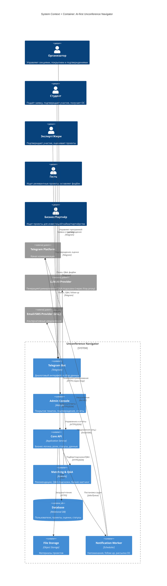

# C4 Architecture: AI-first Unconference Navigator

> Версия: 1.1
> Дата: 2 февраля 2026
> Основано на: Brief v3.0, USM v2.1, RICE v4.0, NFR v1

## 1. Обзор системы

**Назначение:** AI-куратор Demo Day, который помогает 5 ролям (организаторы, студенты, эксперты, гости, бизнес/партнёры) находить релевантные проекты, подтверждать участие, получать напоминания, Q&A-подсказки и собирать обратную связь/фоллоу-ап.
**Ключевые пользователи:** организатор/модератор, студент/участник, эксперт/жюри, гость, бизнес/партнёр.
**Внешние зависимости:** Telegram Platform, LLM/AI Provider (через Xray API proxy), (опц.) Email/SMS provider.

## 2. Архитектурная диаграмма

## 3. Описание компонентов

### Контейнеры

| Контейнер | Технология | Назначение | Масштабирование |
|---|---|---|---|
| Telegram Bot | Telegram | Диалоговый интерфейс для всех 5 ролей | Горизонтально при росте нагрузки |
| Admin Console | Web UI | Контроль покрытий, подтверждений, отчётов | Горизонтально по числу орг-пользователей |
| Core API | Application Service | Бизнес-логика, роли, статусы, данные | Горизонтально |
| Matching & Q&A | Rules/AI | Рекомендации, Q&A-подсказки (гости/бизнес), бизнес-матчинг | Горизонтально/по требованию |
| Database | Relational DB | Хранение пользователей, проектов, оценок | Вертикально + репликация |
| File Storage | Object Storage | Материалы проектов | Масштабируется по объёму |
| Notification Worker | Scheduler | Напоминания, follow-up пакеты, рассылка ОС | Горизонтально по очереди задач |

### Внешние системы

| Система | Назначение | Интеграция | Fallback |
|---|---|---|---|
| Telegram Platform | Канал коммуникации | Bot API | Нет (основной канал) |
| LLM/AI Provider | Генерация Q&A-подсказок, суммирование проектов | HTTPS API через Xray proxy | Правила/шаблоны без AI |
| Email/SMS Provider (опц.) | Альтернативные уведомления | API | Только Telegram |

## 4. Потоки данных

### Основной поток
Пользователь → Telegram Bot / Admin Console → Core API → Database / File Storage → Ответ пользователю.

### Q&A-подсказки (гости/бизнес, H10)
Пользователь запрашивает подсказки → Core API → Matching & Q&A → LLM (через Xray) → Подсказки вопросов → Пользователю.

### Асинхронные операции
Core API → Notification Worker → Telegram Platform / Email/SMS Provider.

## 5. Ключевые решения

| Решение | Выбор | Почему | Альтернативы |
|---|---|---|---|
| Канал для пользователей | Telegram-first | Быстрый доступ и привычный канал | Отдельное приложение / веб-кабинет |
| 5-ролевая модель | Да | CustDev: разные JTBD у гостей vs бизнес-партнёров (H14, H17) | 4 роли (гость + бизнес объединены) |
| AI-подсказки для Q&A | Только гости + бизнес | CustDev: эксперт отказался — «вопросы от человека» (интервью #2) | Q&A для всех |
| 1:1 встречи | Нет в MVP | CustDev: H15 депр. (RICE 12, гость 1/5). Только запрос контакта | Полноценное расписание встреч |
| Профилирование | Кнопки + текст (5–10 мин) | CustDev: «варианты + текст» (интервью #4, H16) | Только свободный текст |
| Напоминания через воркер | Да | Устойчивость к пикам и дедлайнам | Синхронные отправки |
| AI через Xray proxy | Да | Инфраструктура кэмпа: централизованный AI API proxy | Прямое подключение к API |

## 6. Нерешённые вопросы

- [ ] Требуется ли email-канал как резервный?
- [ ] Политика хранения материалов и оценок (сроки).

## Решённые вопросы (из v1.0)

- [x] ~~Нужны ли интеграции с календарями для 1:1 встреч?~~ — **Нет.** H15 депр. (RICE 12, гость 1/5).

---

## Приложения

### Изменения v1.0 → v1.1

| Что изменено | Было (v1.0) | Стало (v1.1) |
|---|---|---|
| Persons | 4 (Организатор, Эксперт, Участник, Гость/Партнёр) | 5 (+Студент, +Бизнес/Партнёр отдельно) |
| Matching контейнер | «Рекомендации и подсказки» | +Q&A-подсказки, +бизнес-матчинг |
| Worker | «Напоминания и follow-up» | +рассылка ОС студентам |
| AI Provider | «Опционально» | Через Xray proxy (инфра кэмпа) |
| 1:1 встречи | Открытый вопрос | Закрыт: НЕТ (H15 депр.) |
| Источники | Brief v1, USM v1, NFR v1 | Brief v3.0, USM v2.1, RICE v4.0 |
