# Data Model: AI-first Unconference Navigator

> Версия: 1.1
> Дата: 2 февраля 2026
> Основано на: Brief v3.0, USM v2.1, RICE v4.0, NFR v1

## 1. Обзор

**Всего сущностей:** 24 (+2 от v1.0)
**Тип БД:** Relational DB (SQL)

### Группы
- **Core:** users, roles, user_roles, events
- **Business:** projects, sessions, participation_requests, project_reviews, contact_requests, qa_suggestions
- **Reference:** tags, stages, tracks, sections
- **Junction:** project_members, project_tags, user_interests, user_interest_keywords, shortlists, project_sessions

### Изменения v1.0 → v1.1
- `users`: добавлено поле `guest_subtype` (H16)
- Новая таблица `qa_suggestions` (H10, Q&A-помощник для гостей/бизнеса)
- Новая таблица `business_profiles` (H14, бизнес-профилирование)
- `contact_requests`: добавлено поле `message` для текста запроса

---

## 2. ER-диаграмма

```mermaid
erDiagram
    users {
        uuid id PK
        string full_name
        string email
        string phone
        string telegram_user_id
        string organization
        enum guest_subtype "applicant/ai_practitioner/other (nullable, H16)"
        timestamp created_at
        timestamp updated_at
    }

    roles {
        uuid id PK
        string code UK "organizer/student/expert/guest/business"
        string name
    }

    role_invites {
        uuid id PK
        uuid event_id FK
        uuid role_id FK
        uuid created_by FK
        string code UK
        enum status
        timestamp expires_at
        timestamp created_at
    }

    access_requests {
        uuid id PK
        uuid event_id FK
        uuid user_id FK
        enum role_requested
        enum status
        timestamp created_at
    }

    user_roles {
        uuid id PK
        uuid user_id FK
        uuid role_id FK
        uuid event_id FK
        timestamp created_at
    }

    events {
        uuid id PK
        string name
        date start_date
        date end_date
        string location
        enum format
        string timezone
        timestamp created_at
    }

    tracks {
        uuid id PK
        uuid event_id FK
        string name
        enum type
        text description
    }

    sections {
        uuid id PK
        uuid track_id FK
        string name
        string room
    }

    sessions {
        uuid id PK
        uuid section_id FK
        string title
        timestamp start_at
        timestamp end_at
        enum status
    }

    stages {
        uuid id PK
        string name UK
    }

    tags {
        uuid id PK
        string name
        enum tag_type
    }

    projects {
        uuid id PK
        uuid event_id FK
        uuid stage_id FK
        string title
        text summary
        enum track_type "startup/research/industry/education"
        timestamp created_at
    }

    project_members {
        uuid id PK
        uuid project_id FK
        uuid user_id FK
        enum role_in_project
    }

    project_materials {
        uuid id PK
        uuid project_id FK
        enum material_type
        string title
        string url
        timestamp uploaded_at
    }

    project_tags {
        uuid id PK
        uuid project_id FK
        uuid tag_id FK
    }

    user_interests {
        uuid id PK
        uuid user_id FK
        uuid tag_id FK
        int weight
    }

    user_interest_keywords {
        uuid id PK
        uuid user_id FK
        text keyword
    }

    business_profiles {
        uuid id PK
        uuid user_id FK
        uuid event_id FK
        string industry "отрасль"
        enum partnership_format "investment/hiring/partnership/mentoring"
        enum preferred_stage "mvp/pilot/scale"
        text description "свободное описание интересов"
        timestamp created_at
    }

    shortlists {
        uuid id PK
        uuid user_id FK
        uuid project_id FK
        timestamp created_at
    }

    project_sessions {
        uuid id PK
        uuid project_id FK
        uuid session_id FK
    }

    participation_requests {
        uuid id PK
        uuid event_id FK
        uuid user_id FK
        uuid section_id FK
        uuid session_id FK
        enum role
        string topic
        timestamp proposed_time
        enum status
        timestamp confirmed_at
    }

    project_reviews {
        uuid id PK
        uuid event_id FK
        uuid project_id FK
        uuid reviewer_id FK
        decimal overall_score "взвешенный % (0-100)"
        text comment
        enum track_type "startup/research/industry/education"
        timestamp created_at
    }

    project_review_items {
        uuid id PK
        uuid project_review_id FK
        string criterion "название критерия"
        int score "1-3 (1=низкий, 2=средний, 3=высокий)"
        decimal weight "вес критерия (0.1 или 0.2)"
    }

    event_feedback {
        uuid id PK
        uuid event_id FK
        uuid user_id FK
        int overall_score
        text interesting_talks
        text improvements
        timestamp submitted_at
    }

    contact_requests {
        uuid id PK
        uuid event_id FK
        uuid user_id FK
        uuid project_id FK
        text message "текст запроса (опц.)"
        enum status
        timestamp created_at
    }

    qa_suggestions {
        uuid id PK
        uuid user_id FK
        uuid project_id FK
        text questions "JSON: список AI-подсказок вопросов"
        text context "контекст генерации (профиль + проект)"
        timestamp generated_at
    }

    notifications {
        uuid id PK
        uuid event_id FK
        uuid user_id FK
        enum channel
        enum notification_type
        timestamp scheduled_at
        timestamp sent_at
        enum status
    }

    users ||--o{ user_roles : "has"
    roles ||--o{ user_roles : "assigned"
    events ||--o{ user_roles : "context"

    events ||--o{ role_invites : "invites"
    roles ||--o{ role_invites : "for role"
    users ||--o{ role_invites : "created by"

    events ||--o{ access_requests : "access requests"
    users ||--o{ access_requests : "requests"

    events ||--o{ tracks : "has"
    tracks ||--o{ sections : "contains"
    sections ||--o{ sessions : "hosts"

    events ||--o{ projects : "includes"
    stages ||--o{ projects : "classifies"

    projects ||--o{ project_members : "has"
    users ||--o{ project_members : "member"

    projects ||--o{ project_materials : "has"
    projects ||--o{ project_tags : "tagged"
    tags ||--o{ project_tags : "tag"

    users ||--o{ user_interests : "interests"
    tags ||--o{ user_interests : "tag"
    users ||--o{ user_interest_keywords : "keywords"

    users ||--o{ business_profiles : "biz profile"
    events ||--o{ business_profiles : "context"

    users ||--o{ shortlists : "saves"
    projects ||--o{ shortlists : "saved"

    projects ||--o{ project_sessions : "scheduled"
    sessions ||--o{ project_sessions : "includes"

    users ||--o{ participation_requests : "requests"
    sections ||--o{ participation_requests : "for"
    sessions ||--o{ participation_requests : "slot"

    projects ||--o{ project_reviews : "reviewed"
    users ||--o{ project_reviews : "reviewer"
    project_reviews ||--o{ project_review_items : "criteria"

    events ||--o{ event_feedback : "feedback"
    users ||--o{ event_feedback : "submitted"

    events ||--o{ contact_requests : "contacts"
    users ||--o{ contact_requests : "requests"
    projects ||--o{ contact_requests : "for"

    users ||--o{ qa_suggestions : "receives"
    projects ||--o{ qa_suggestions : "about"

    events ||--o{ notifications : "sends"
    users ||--o{ notifications : "receives"
```

---

## 3. Описание сущностей

### users
**Назначение:** все пользователи системы (организаторы, студенты, эксперты, гости, бизнес-партнёры).
**Data Dictionary:**
| Поле | Тип | Null | Default | Описание |
|---|---|---|---|---|
| id | UUID | NO | gen | PK |
| full_name | string | YES | — | Имя пользователя |
| email | string | YES | — | Email (если есть) |
| phone | string | YES | — | Телефон (если есть) |
| telegram_user_id | string | YES | — | ID пользователя в Telegram |
| organization | string | YES | — | Компания/организация |
| guest_subtype | enum | YES | NULL | Подтип гостя: applicant/ai_practitioner/other (H16) |
| created_at | timestamp | NO | now | Создание |
| updated_at | timestamp | NO | now | Обновление |

**Бизнес-правила:**
- Роль пользователя определяется через user_roles в контексте конкретного события.
- `guest_subtype` заполняется только для роли «Гость» при онбординге.
- Роли: organizer, student, expert, guest, business (5 ролей).

### events
**Назначение:** отдельный Demo Day / мероприятие.
**Data Dictionary:**
| Поле | Тип | Null | Default | Описание |
|---|---|---|---|---|
| id | UUID | NO | gen | PK |
| name | string | NO | — | Название события |
| start_date | date | NO | — | Дата начала |
| end_date | date | NO | — | Дата окончания |
| location | string | YES | — | Локация |
| format | enum | NO | — | offline/online/hybrid |
| timezone | string | YES | — | Часовой пояс |
| created_at | timestamp | NO | now | Создание |

### role_invites
**Назначение:** приглашения на роль «Организатор» (код или назначение админом).
**Data Dictionary:**
| Поле | Тип | Null | Default | Описание |
|---|---|---|---|---|
| id | UUID | NO | gen | PK |
| event_id | UUID | NO | — | FK → events |
| role_id | UUID | NO | — | FK → roles |
| created_by | UUID | NO | — | FK → users (организатор/админ) |
| code | string | NO | — | Код приглашения |
| status | enum | NO | active | active/used/expired |
| expires_at | timestamp | YES | — | Срок действия |
| created_at | timestamp | NO | now | Создание |

### access_requests
**Назначение:** запросы на назначение роли (например, организатор).
**Data Dictionary:**
| Поле | Тип | Null | Default | Описание |
|---|---|---|---|---|
| id | UUID | NO | gen | PK |
| event_id | UUID | NO | — | FK → events |
| user_id | UUID | NO | — | FK → users |
| role_requested | enum | NO | organizer | Запрашиваемая роль |
| status | enum | NO | pending | pending/approved/declined |
| created_at | timestamp | NO | now | Создание |

### business_profiles
**Назначение:** расширенный профиль бизнес/партнёров (H14, RICE 23).
**Data Dictionary:**
| Поле | Тип | Null | Default | Описание |
|---|---|---|---|---|
| id | UUID | NO | gen | PK |
| user_id | UUID | NO | — | FK → users |
| event_id | UUID | NO | — | FK → events |
| industry | string | YES | — | Отрасль (FinTech, EdTech, HealthTech...) |
| partnership_format | enum | YES | — | investment/hiring/partnership/mentoring |
| preferred_stage | enum | YES | — | mvp/pilot/scale |
| description | text | YES | — | Свободное описание интересов |
| created_at | timestamp | NO | now | Создание |

**Бизнес-правила:**
- Создаётся только для роли «Бизнес/партнёр» при профилировании.
- Используется Matching-контейнером для бизнес-матчинга.

### qa_suggestions
**Назначение:** AI-подсказки вопросов для Q&A по проекту (H10, RICE 50).
**Data Dictionary:**
| Поле | Тип | Null | Default | Описание |
|---|---|---|---|---|
| id | UUID | NO | gen | PK |
| user_id | UUID | NO | — | FK → users (гость или бизнес) |
| project_id | UUID | NO | — | FK → projects |
| questions | text | NO | — | JSON-массив подсказок вопросов |
| context | text | YES | — | Контекст генерации (профиль + summary проекта) |
| generated_at | timestamp | NO | now | Время генерации |

**Бизнес-правила:**
- Генерируется только для ролей «Гость» и «Бизнес/партнёр» (эксперты отказались — интервью #2).
- Кэшируется: если профиль и проект не менялись, повторно не генерируется.

### projects
**Назначение:** проекты/команды, выступающие на мероприятии.
**Data Dictionary:**
| Поле | Тип | Null | Default | Описание |
|---|---|---|---|---|
| id | UUID | NO | gen | PK |
| event_id | UUID | NO | — | FK → events |
| stage_id | UUID | YES | — | FK → stages |
| title | string | NO | — | Название проекта |
| summary | text | YES | — | Краткий бриф |
| track_type | enum | YES | — | startup/research/industry/education |
| created_at | timestamp | NO | now | Создание |

### participation_requests
**Назначение:** заявки/подтверждения участия экспертов и студентов.
**Data Dictionary:**
| Поле | Тип | Null | Default | Описание |
|---|---|---|---|---|
| id | UUID | NO | gen | PK |
| event_id | UUID | NO | — | FK → events |
| user_id | UUID | NO | — | FK → users |
| section_id | UUID | YES | — | FK → sections |
| session_id | UUID | YES | — | FK → sessions |
| role | enum | NO | — | student/expert |
| topic | string | YES | — | Тема выступления |
| proposed_time | timestamp | YES | — | Предложенное время |
| status | enum | NO | submitted | submitted/confirmed/declined |
| confirmed_at | timestamp | YES | — | Время подтверждения |

### project_reviews
**Назначение:** оценки экспертов по проектам.
**Data Dictionary:**
| Поле | Тип | Null | Default | Описание |
|---|---|---|---|---|
| id | UUID | NO | gen | PK |
| event_id | UUID | NO | — | FK → events |
| project_id | UUID | NO | — | FK → projects |
| reviewer_id | UUID | NO | — | FK → users |
| overall_score | decimal | NO | — | Взвешенный итоговый % (0–100). Формула: `AVERAGEIF(scores,">0")/2.4*100` |
| comment | text | YES | — | Свободный комментарий эксперта |
| track_type | enum | YES | — | startup/research/industry/education |
| created_at | timestamp | NO | now | Создание |

**Критерии оценки (7 шт., различаются по формату):**
| # | Критерий | Вес | Шкала |
|---|----------|-----|-------|
| 1 | Актуальность | 10% | 1–3 |
| 2 | Практическая значимость и ценность | 10% | 1–3 |
| 3 | Новизна | 10% | 1–3 |
| 4 | Оценка импакта | 10% | 1–3 |
| 5 | R&D: Технологическая сложность | 10% | 1–3 |
| 6 | Потенциал масштабирования | 10% | 1–3 |
| 7 | **Зависит от формата:** | **20%** | 1–3 |

**Критерий 7 по форматам:**
- Research (AITalConf): Публичность
- Demo Day: Качество реализации (методологическая оценка)
- Бизнес: Валидация и готовность к использованию

### event_feedback
**Назначение:** обратная связь гостей и бизнес-партнёров по событию.
**Data Dictionary:**
| Поле | Тип | Null | Default | Описание |
|---|---|---|---|---|
| id | UUID | NO | gen | PK |
| event_id | UUID | NO | — | FK → events |
| user_id | UUID | NO | — | FK → users |
| overall_score | int | YES | — | Насколько понравилось (1–5) |
| interesting_talks | text | YES | — | Самые интересные доклады |
| improvements | text | YES | — | Что улучшить |
| submitted_at | timestamp | NO | now | Отправка |

### contact_requests
**Назначение:** запросы «хочу контакт» по проектам (НЕ 1:1 встречи).
**Data Dictionary:**
| Поле | Тип | Null | Default | Описание |
|---|---|---|---|---|
| id | UUID | NO | gen | PK |
| event_id | UUID | NO | — | FK → events |
| user_id | UUID | NO | — | FK → users |
| project_id | UUID | NO | — | FK → projects |
| message | text | YES | — | Текст запроса (опционально) |
| status | enum | NO | requested | requested/approved/shared |
| created_at | timestamp | NO | now | Создание |

### notifications
**Назначение:** напоминания и follow-up.
**Data Dictionary:**
| Поле | Тип | Null | Default | Описание |
|---|---|---|---|---|
| id | UUID | NO | gen | PK |
| event_id | UUID | NO | — | FK → events |
| user_id | UUID | NO | — | FK → users |
| channel | enum | NO | telegram | telegram/email/sms |
| notification_type | enum | NO | — | deadline/reminder/followup/feedback_request/timing_shift |
| scheduled_at | timestamp | NO | — | План отправки |
| sent_at | timestamp | YES | — | Факт отправки |
| status | enum | NO | pending | pending/sent/failed |

---

## 4. Связи

| Связь | Тип | Описание | Каскад |
|---|---|---|---|
| users → user_roles | 1:N | Роли пользователя в контексте события | on delete cascade |
| events → role_invites | 1:N | Приглашения на роль | on delete cascade |
| events → access_requests | 1:N | Запросы доступа на роль | on delete cascade |
| events → projects | 1:N | Проекты принадлежат событию | on delete cascade |
| tracks → sections | 1:N | Секции внутри трека | on delete cascade |
| sections → sessions | 1:N | Сессии по расписанию | on delete cascade |
| projects ↔ tags | N:M | Тематики/индустрии | on delete cascade |
| users ↔ tags | N:M | Интересы пользователя | on delete cascade |
| users → business_profiles | 1:N | Бизнес-профиль (по событиям) | on delete cascade |
| users → qa_suggestions | 1:N | Q&A-подсказки | on delete cascade |
| projects → qa_suggestions | 1:N | Подсказки по проекту | on delete cascade |
| users → participation_requests | 1:N | Подтверждения участия | on delete cascade |
| projects → project_reviews | 1:N | Оценки экспертов | on delete cascade |
| users → contact_requests | 1:N | Запросы контакта | on delete cascade |

---

## 5. Миграции (порядок)

1. Reference tables (roles, stages, tags)
2. Core tables (users, events)
3. Business tables (projects, tracks, sections, sessions, business_profiles)
4. Junction tables (user_roles, project_tags, user_interests, project_sessions)
5. Feedback/requests (project_reviews, event_feedback, contact_requests, qa_suggestions, notifications)
