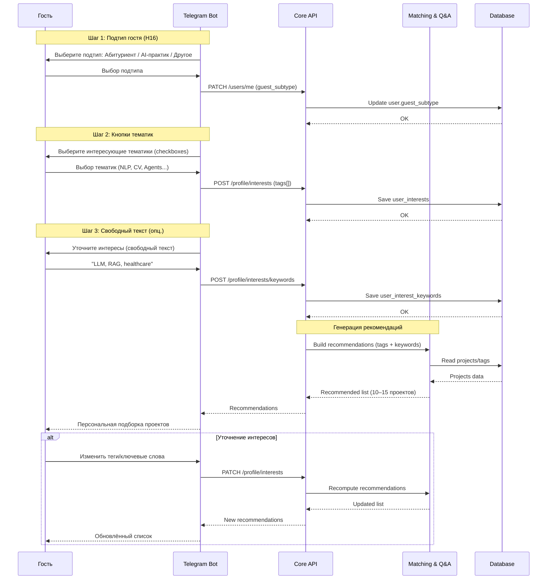
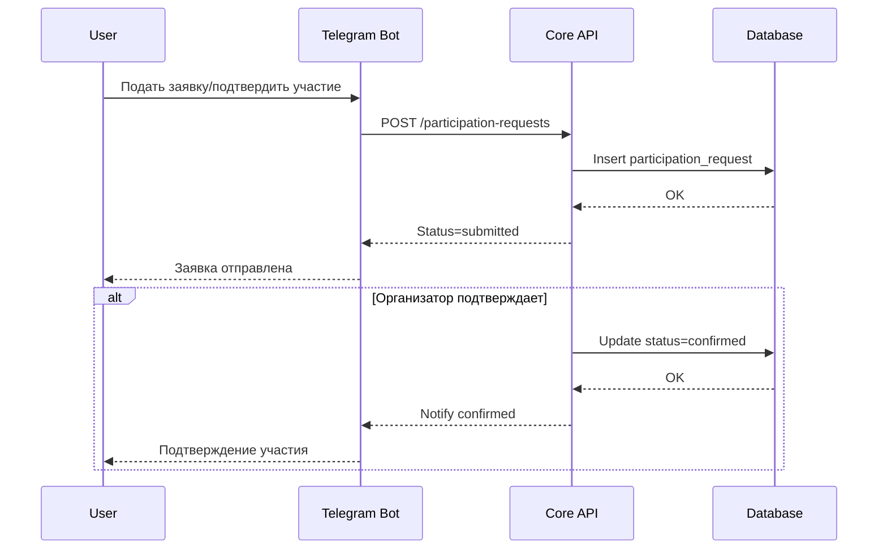
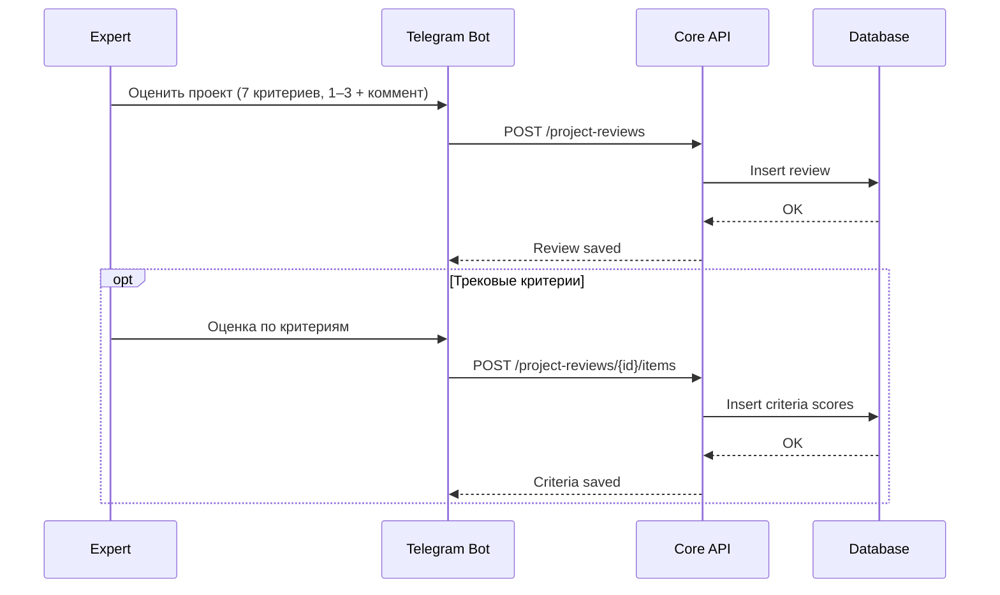
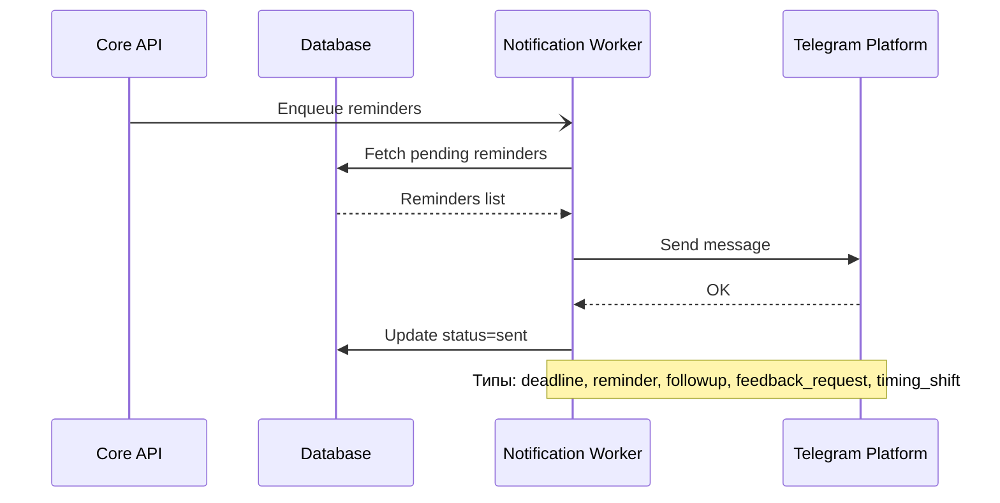
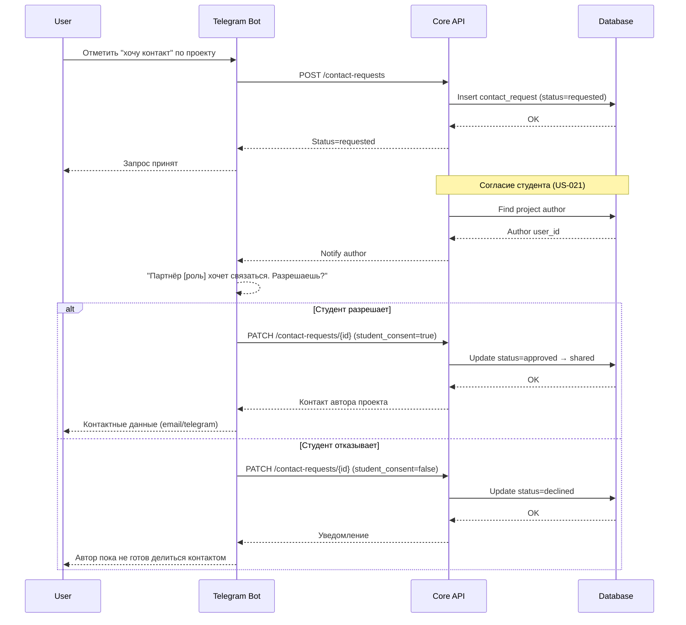
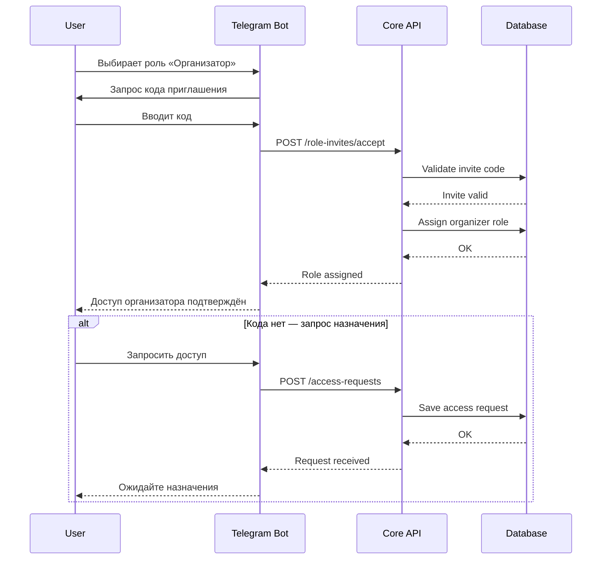
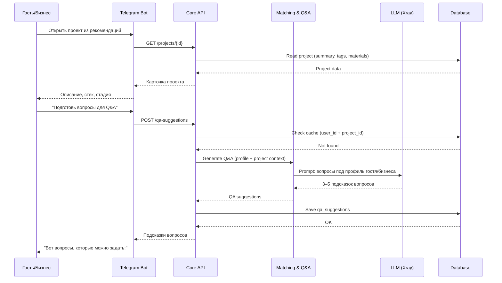
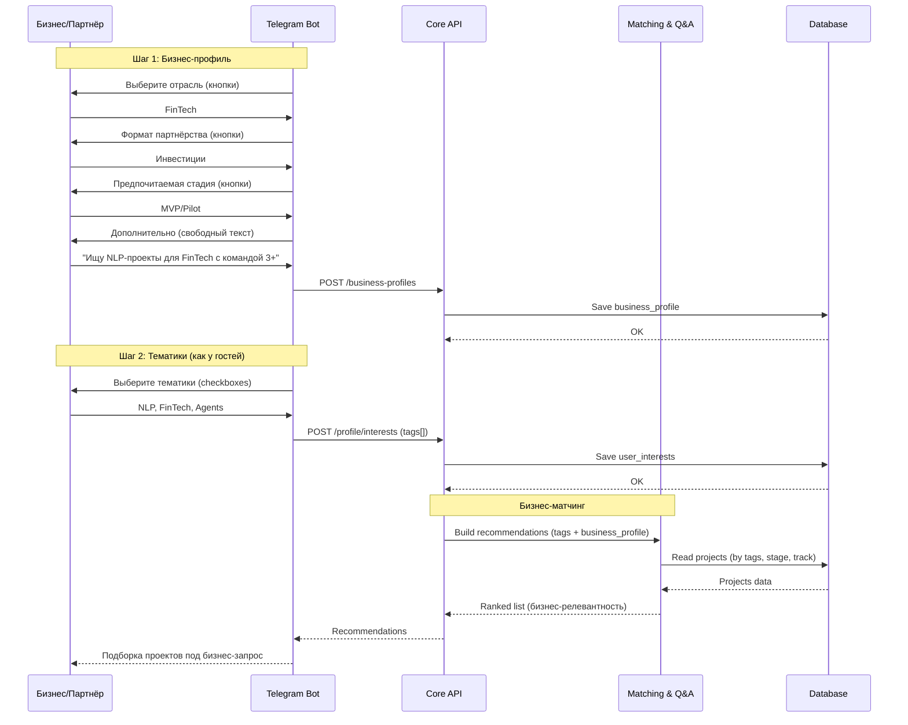

# Sequence Diagrams: AI-first Unconference Navigator

> Версия: 1.2
> Дата: 2 февраля 2026
> Основано на: USM v2.1, C4 v1.1, ER v1.1, RICE v4.0
> Изменения v1.2: Исправлены кросс-ссылки на US/SS (#2, #3, #5), шкала оценки 1–3 (не 1–5), добавлено согласие студента в #5

## Обзор

| # | Сценарий | Сложность | Участники |
|---|----------|-----------|-----------|
| 1 | Профиль интересов + рекомендации (гость) | Средняя | User, Telegram Bot, Core API, Matching, DB |
| 2 | Подтверждение участия (эксперт/студент) | Средняя | User, Telegram Bot, Core API, DB |
| 3 | Оценка проекта + критерии | Средняя | User, Telegram Bot, Core API, DB |
| 4 | Напоминания о дедлайнах (async) | Средняя | Worker, Core API, Telegram, DB |
| 5 | Follow-up «хочу контакт» | Низкая | User, Telegram Bot, Core API, DB |
| 6 | Роль организатора по приглашению | Средняя | User, Telegram Bot, Core API, DB |
| 7 | Q&A-помощник (гость/бизнес) | Средняя | User, Telegram Bot, Core API, Matching, AI, DB |
| 8 | Бизнес-профилирование + рекомендации | Средняя | User, Telegram Bot, Core API, Matching, DB |

---

## 1. Профиль интересов + рекомендации (гость)

### Контекст

**User Story:** US-002, US-009, SS-002, SS-003
**Участники:** Гость, Telegram Bot, Core API, Matching, DB
**CustDev:** H8 (RICE 27, 100%), H16 (RICE 66, 60%) — «кнопки тематик + свободный текст, 5–10 мин»

### Диаграмма

### Примечания
- Двухшаговое профилирование: кнопки (быстрый выбор) → свободный текст (уточнение).
- Подтип гостя влияет на ранжирование рекомендаций (абитуриенты видят больше EdTech).
- Пересчёт рекомендаций должен быть быстрым (пик 100 пользователей).

---

## 2. Подтверждение участия (эксперт/студент)

### Контекст

**User Story:** US-005, US-007, SS-003, SS-004
**Участники:** Пользователь, Telegram Bot, Core API, DB

### Диаграмма

### Примечания
- В MVP статусы: submitted → confirmed.

---

## 3. Оценка проекта + критерии

### Контекст

**User Story:** US-019
**Участники:** Эксперт, Telegram Bot, Core API, DB

### Диаграмма

### Примечания
- 7 критериев, каждый 1–3 (веса 6×10% + 1×20%). Итого overall_score = взвешенный % (0–100).
- Подсказки по критериям показываются в боте перед оценкой.
- Эксперт сам формулирует вопросы — AI-подсказки для Q&A НЕ предлагаются (интервью #2: «вопросы от человека должны исходить»).

---

## 4. Напоминания о дедлайнах (async)

### Контекст

**User Story:** SS-005, SS-007, SS-016
**Участники:** Core API, Worker, DB, Telegram

### Диаграмма

### Примечания
- В день события и после — повторная отправка формы обратной связи.
- Уведомления о сдвигах тайминга (SS-016, USM v2.1).

---

## 5. Follow-up «хочу контакт»

### Контекст

**User Story:** US-020, US-021
**Участники:** Пользователь (гость/бизнес/эксперт), Telegram Bot, Core API, DB
**CustDev:** H15 депр. (RICE 12, гость 1/5) — только запрос контакта, НЕ 1:1 встречи.

### Диаграмма

### Примечания
- Это запрос контакта, а не запись на 1:1 встречу.
- Требуется согласие студента (US-021, 152-ФЗ). Организатор может модерировать дополнительно.
- Доступно ролям: Гость, Бизнес/партнёр, Эксперт.

---

## 6. Роль организатора по приглашению

### Контекст

**User Story:** US-002, SS-001
**Участники:** Пользователь, Telegram Bot, Core API, DB

### Диаграмма

### Примечания
- Назначение админом может происходить вне бота; уведомление приходит через Telegram.

---

## 7. Q&A-помощник (гость/бизнес)

### Контекст

**User Story:** US-012, H10 (RICE 50, 100%)
**Участники:** Гость или Бизнес/партнёр, Telegram Bot, Core API, Matching, AI, DB
**CustDev:** Гость хочет подсказки (интервью #4: 5/5). Эксперт — нет (интервью #2: «от человека»).

### Диаграмма

### Примечания
- Подсказки кэшируются: при повторном запросе возвращаются из БД.
- Контекст генерации: профиль пользователя (интересы + подтип/бизнес-профиль) + summary проекта.
- Для бизнес-партнёров вопросы ориентированы на: стадия, монетизация, команда, IP.

---

## 8. Бизнес-профилирование + рекомендации

### Контекст

**User Story:** H14 (RICE 23, 100%), H17 (RICE 23, 100%)
**Участники:** Бизнес/партнёр, Telegram Bot, Core API, Matching, DB

### Диаграмма

### Примечания
- Бизнес-профиль хранится отдельно от user_interests (разные сущности: business_profiles vs user_interests).
- Рекомендации учитывают и тематики (user_interests), и бизнес-контекст (partnership_format, stage).
- Follow-up пакет (H17) отправляется через Notification Worker после DD.

---

## Приложения

### Участники (из C4 v1.1)

| ID | Название | Тип | Описание |
|---|---|---|---|
| User | Пользователь | Actor | Организатор/студент/эксперт/гость/бизнес |
| Telegram Bot | Container | UI | Диалоговый интерфейс |
| Core API | Container | Service | Бизнес-логика |
| Matching & Q&A | Container | Service | Рекомендации, Q&A-подсказки, бизнес-матчинг |
| Database | ContainerDb | Data | Основные данные |
| Notification Worker | Container | Async | Напоминания, follow-up, рассылка ОС |
| Telegram Platform | System_Ext | External | Канал сообщений |
| LLM (Xray) | System_Ext | External | AI-генерация через Xray proxy |

### Соглашения

- `->>` / `-->>` — синхронные
- `-)` / `--)` — асинхронные
- `-x` — ошибка

### Изменения v1.1 → v1.2

| Что изменено | Описание |
|---|---|
| Сценарий 2 | Исправлены ссылки: US-008/009/010 → US-005, US-007, SS-003, SS-004 |
| Сценарий 3 | Исправлены ссылки: US-014/015/015a → US-019. Шкала: 1–5 → 1–3 (7 критериев) |
| Сценарий 5 | Исправлены ссылки: US-017/SS-008 → US-020, US-021. Добавлен шаг согласия студента |

### Изменения v1.0 → v1.1

| Что изменено | Описание |
|---|---|
| Сценарий 1 | Разбит на 3 шага: подтип → кнопки → текст (CustDev H16) |
| Сценарий 5 | Уточнено: запрос контакта, НЕ 1:1 встречи (H15 депр.) |
| Сценарий 7 | **Новый:** Q&A-помощник для гостей/бизнеса (H10) |
| Сценарий 8 | **Новый:** Бизнес-профилирование + рекомендации (H14) |
| Участники | +LLM (Xray), роли обновлены до 5 |
