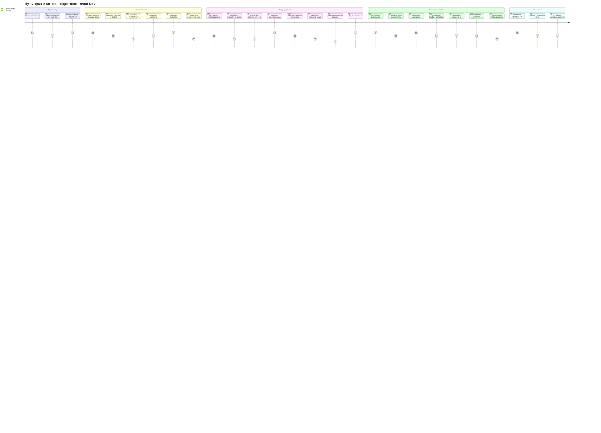

# User Journey Map: UX/UI Админ-панели EventAI

> **Версия:** 1.0
> **Дата:** 2026-02-08
> **Персона:** Организатор (новый, первый Demo Day)
> **Цель:** Подготовить мероприятие от загрузки данных до отправки приглашений
> **Основано на:** Brief v1.0 (admin-panel-ux-brief.md), USM v1.0 (admin-panel-usm.md)

---

## Диаграмма

---

## Анализ по фазам

### Фаза 1: Первый вход

| Действие | Score | Почему такая оценка | Pain Points |
|----------|-------|---------------------|-------------|
| Открывает админку | 5 | Авторизация уже реализована, вход по Telegram | — |
| Видит Dashboard (нет события) | 4 | Empty state с подсказкой, но информации пока мало — может быть ощущение «пустоты» | Первое впечатление: «а где тут всё?» |
| Переходит на Импорт по подсказке | 5 | Явная кнопка-ссылка «Создайте событие на странице Импорта» | — |

**Что думает организатор:** «Окей, тут пока пусто, но мне ясно говорят — иди на Импорт. Логично.»

---

### Фаза 2: Подготовка данных

| Действие | Score | Почему такая оценка | Pain Points |
|----------|-------|---------------------|-------------|
| Создаёт событие | 5 | Простая форма: название, дата начала, дата окончания. Первый таб — сразу на виду | — |
| Загружает проекты | 4 | Файл-аплоад с предпросмотром и валидацией. Но новый пользователь может не знать нужный формат | Какой формат файла? Какие колонки обязательны? |
| Загружает студентов | 3 | Привязка к проектам. Если проекты загружены — ОК. Но ошибки консистентности (студент → несуществующий проект) вызывают стресс | Несоответствия требуют ручного исправления файла |
| Загружает экспертов | 4 | Аналогично проектам — файл + теги/компетенции | Откуда брать теги? Что писать в «компетенции»? |
| Загружает партнёров | 5 | Простая загрузка, минимум полей, нет зависимостей | — |
| Проверяет консистентность | 3 | Система показывает ошибки поимённо. Но если ошибок много — страшно | «10 студентов без проекта — что делать?» |

**Что думает организатор:** «Проекты и партнёры — легко. Студенты — надо аккуратно, иначе привязки поломаются. Хорошо, что система предупреждает.»

---

### Фаза 3: Распределение

| Действие | Score | Почему такая оценка | Pain Points |
|----------|-------|---------------------|-------------|
| Запускает AI-кластеризацию | 4 | Одна кнопка, но нужно выбрать параметры (кол-во залов, критерии). Ожидание результата | Сколько залов ставить? По каким критериям? |
| Проверяет результат по залам | 3 | Визуализация залов с проектами. Нужно проверить каждый зал — много данных | Как понять, хорошо ли AI распределил? |
| Перемещает проекты вручную | 3 | Drag-and-drop работает, но требует экспертного знания тематик | Требует знания предметной области |
| Одобряет кластеризацию | 5 | Явная кнопка + подсказка «далее — эксперты» | — |
| Запускает матчинг экспертов | 4 | Автоматический, одна кнопка | — |
| Проверяет покрытие залов | 3 | Сводная таблица покрытия. Нужно оценить: достаточно ли экспертов на каждый зал | Что значит «достаточно»? |
| Закрывает пробелы вручную | 2 | **Самая болезненная точка.** Нужно найти дополнительных экспертов или перераспределить. Может не быть подходящих экспертов | Нет кандидатов? Что тогда? Нет подсказок |
| Одобряет матчинг | 5 | Ясно, что делать | — |

**Что думает организатор:** «Кластеризация — интересно, AI помогает. Но пробелы в экспертах — головная боль. Где мне взять ещё одного ML-эксперта на зал 3?»

---

### Фаза 4: Расписание и запуск

| Действие | Score | Почему такая оценка | Pain Points |
|----------|-------|---------------------|-------------|
| Генерирует расписание | 5 | Автоматическая генерация из кластеризации | — |
| Проверяет сетку | 4 | Наглядная таблица залы x слоты. Много данных, но структура ясна | Скролл на больших мероприятиях |
| Одобряет расписание | 5 | Чёткое финальное действие | — |
| Отправляет брифинг экспертам | 4 | Предпросмотр + массовая отправка | Хочется убедиться, что текст корректный |
| Настраивает напоминания | 4 | Конфигурация типов напоминаний (eve-of-DD, pre-slot) | Какое время выбрать? |
| Отправляет запросы подтверждения | 4 | Массовая рассылка | — |
| Отслеживает подтверждения | 3 | Сводка: подтвердили / не ответили. Нужно решать, что делать с неответившими | «5 экспертов не ответили за 3 дня — звонить?» |

**Что думает организатор:** «Расписание — автоматически, отлично. Рассылки работают. Но ждать подтверждений — нервно.»

---

### Фаза 5: Мониторинг

| Действие | Score | Почему такая оценка | Pain Points |
|----------|-------|---------------------|-------------|
| Проверяет прогресс на Dashboard | 5 | Global Stepper, метрики, Quick Action — всё на виду | — |
| Смотрит аудиторию бота | 4 | Данные появляются органически. Фильтры и сегменты | Вначале аудитория пуста — нормально ли это? |
| Отправляет целевые рассылки | 4 | Сегментация + шаблоны | — |

**Что думает организатор:** «Dashboard показывает всё. Обратный отсчёт мотивирует. Вижу, кто зашёл в бота.»

---

## Выявленные проблемы

### Критические (Score 1-2)

| # | Фаза | Действие | Проблема | Влияние |
|---|------|----------|----------|---------|
| 1 | Распределение | Закрытие пробелов в покрытии экспертами | Нет механизма помощи: система показывает пробел, но не подсказывает решение. Организатор остаётся один на один с проблемой | Может привести к незакрытым залам или затягиванию подготовки |

### Серьёзные (Score 3 с высоким friction)

| # | Фаза | Действие | Проблема | Влияние |
|---|------|----------|----------|---------|
| 2 | Подготовка данных | Загрузка студентов с привязкой | Ошибки консистентности требуют исправления исходного файла и повторной загрузки | Цикл «загрузил → ошибка → исправил → перезагрузил» утомляет |
| 3 | Подготовка данных | Проверка консистентности | При большом количестве ошибок — паника | Организатор не понимает масштаб проблемы |
| 4 | Распределение | Проверка результата кластеризации | Нет критериев «хорошо/плохо» — организатор сам должен оценить | Неуверенность: «А вдруг AI ошибся?» |
| 5 | Распределение | Проверка покрытия залов | Нет ясного порога: сколько экспертов на зал = достаточно | «3 эксперта на 20 проектов — это нормально?» |

### Gaps в User Story Map

| # | Что отсутствует | Где должно быть | Рекомендация |
|---|-----------------|-----------------|--------------|
| 1 | Подсказки при закрытии пробелов в экспертах | EPIC-006 (Эксперты) | Добавить US: «Система предлагает кандидатов на незакрытые позиции на основе тегов/компетенций» |
| 2 | Шаблон/пример формата файла для импорта | EPIC-003 (Импорт) | Добавить AC в US-009/010/011: «Доступен шаблон файла для скачивания (CSV/XLSX с заголовками)» |
| 3 | Inline-редактирование привязок студентов | EPIC-003 (Импорт) | Добавить AC в US-010: «При ошибке привязки — выпадающий список существующих проектов для выбора» |
| 4 | Метрика качества кластеризации | EPIC-005 (Кластеризация) | Добавить AC в US-016: «Система показывает score кластеризации (распределение по тегам, баланс залов)» |
| 5 | Рекомендуемое количество экспертов на зал | EPIC-006 (Эксперты) | Добавить AC в US-020: «Система показывает рекомендуемый минимум экспертов на зал» |
| 6 | Повторная отправка запроса неответившим | EPIC-009 (Напоминания) | Уже есть в US-029, но стоит добавить: «Автоматическое напоминание через N дней» |

---

## Рекомендации по доработке USM

### Приоритет 1 (Критично)

- [ ] **EPIC-006 (Эксперты):** Добавить user story «Как организатор, я хочу видеть рекомендации системы по закрытию пробелов (подходящие эксперты по тегам), чтобы не искать вручную» — закрывает единственную критическую точку (score 2)

### Приоритет 2 (Важно)

- [ ] **EPIC-003 (Импорт):** В US-009, US-010, US-011 добавить AC: «Доступен шаблон файла для скачивания» — снижает тревогу при первом импорте
- [ ] **EPIC-003 (Импорт):** В US-010 добавить AC: «При ошибке привязки — inline-выбор из существующих проектов» — убирает цикл «исправь файл → перезагрузи»
- [ ] **EPIC-005 (Кластеризация):** В US-016 добавить AC: «Система показывает метрику качества кластеризации (баланс залов, тематическая однородность)» — даёт критерий оценки
- [ ] **EPIC-006 (Эксперты):** В US-020 добавить AC: «Отображается рекомендуемый минимум экспертов на зал» — даёт ориентир

### Приоритет 3 (Улучшение)

- [ ] **EPIC-009 (Напоминания):** В US-029 добавить AC: «Автоматический повтор запроса через N дней для неответивших» — снижает ручной труд
- [ ] **EPIC-003 (Импорт):** Добавить AC: «Подсказка о формате данных при наведении на поле» — контекстная помощь

---

## Метрики

- **Средний score:** 4.0 / 5
- **Критических точек (score <= 2):** 1
- **Самая слабая фаза:** Распределение (avg: 3.5)
- **Самая сильная фаза:** Мониторинг (avg: 4.3)

---

## Следующие шаги

1. [ ] Обсудить критическую проблему (пробелы в экспертах) со стейкхолдером
2. [ ] Обновить USM по рекомендациям приоритета 1-2
3. [ ] Перейти к `/discovery.nfr` (нефункциональные требования) или `/discovery.ia` (информационная архитектура)
