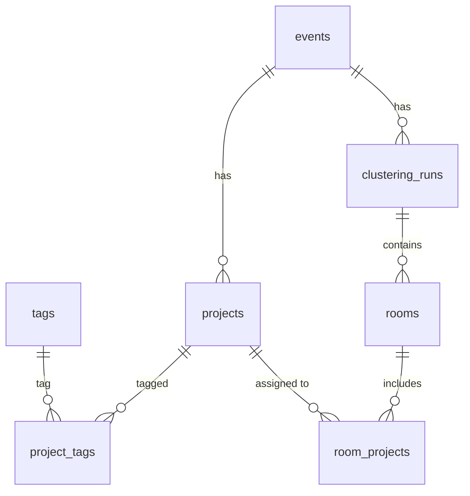

# Data Model: Загрузка и AI-кластеризация проектов

**Branch**: `002-project-clustering` | **Date**: 2026-02-02
**Based on**: ER Diagram v1.1, Spec clarifications

---

## Overview

Добавляет 5 таблиц к существующей схеме (EPIC-001: users, roles, events, user_roles).
Переиспользует существующие `events` и `users` через FK.

## New Tables

### projects

Проекты, загруженные организатором или из seed-данных.

| Field | Type | Null | Default | Description |
|-------|------|------|---------|-------------|
| id | UUID | NO | gen_random_uuid() | PK |
| event_id | UUID | NO | — | FK → events.id |
| title | VARCHAR(500) | NO | — | Название проекта |
| description | TEXT | NO | — | Описание (план работы / summary) |
| author | VARCHAR(300) | NO | — | Автор / команда |
| telegram_contact | VARCHAR(100) | NO | — | Telegram-контакт автора |
| source | VARCHAR(20) | NO | 'upload' | 'seed' / 'upload' — источник данных |
| created_at | TIMESTAMPTZ | NO | now() | Дата создания |

**Constraints:**
- UNIQUE(event_id, title) — дубликаты по названию в рамках события
- FK event_id → events(id) ON DELETE CASCADE

**Business Rules:**
- Все 5 полей обязательны при загрузке (Clarify Q1)
- Дубликаты определяются по exact match title в рамках одного event
- source='seed' для предзагруженных данных, 'upload' для загруженных организатором

---

### tags

Тематические теги проектов.

| Field | Type | Null | Default | Description |
|-------|------|------|---------|-------------|
| id | UUID | NO | gen_random_uuid() | PK |
| name | VARCHAR(100) | NO | — | Название тега (NLP, CV, Agents, ...) |
| created_at | TIMESTAMPTZ | NO | now() | Дата создания |

**Constraints:**
- UNIQUE(name)

---

### project_tags

M2M связь проектов и тегов.

| Field | Type | Null | Default | Description |
|-------|------|------|---------|-------------|
| id | UUID | NO | gen_random_uuid() | PK |
| project_id | UUID | NO | — | FK → projects.id |
| tag_id | UUID | NO | — | FK → tags.id |

**Constraints:**
- UNIQUE(project_id, tag_id)
- FK project_id → projects(id) ON DELETE CASCADE
- FK tag_id → tags(id) ON DELETE CASCADE

---

### clustering_runs

Запуски кластеризации с параметрами и статусом.

| Field | Type | Null | Default | Description |
|-------|------|------|---------|-------------|
| id | UUID | NO | gen_random_uuid() | PK |
| event_id | UUID | NO | — | FK → events.id |
| num_rooms | INTEGER | NO | 6 | Количество залов |
| status | VARCHAR(20) | NO | 'draft' | 'draft' / 'approved' / 'superseded' |
| feedback | TEXT | YES | NULL | NL-фидбэк организатора для перегенерации |
| llm_model | VARCHAR(100) | YES | NULL | Модель LLM (для аудита) |
| created_at | TIMESTAMPTZ | NO | now() | Дата создания |
| approved_at | TIMESTAMPTZ | YES | NULL | Дата утверждения |

**Constraints:**
- FK event_id → events(id) ON DELETE CASCADE

**Business Rules:**
- При новой кластеризации — предыдущая переходит в status='superseded'
- При утверждении — status='approved', approved_at=now()
- Только один active (draft/approved) clustering_run на event

---

### rooms

Залы — результат кластеризации. Привязаны к clustering_run.

| Field | Type | Null | Default | Description |
|-------|------|------|---------|-------------|
| id | UUID | NO | gen_random_uuid() | PK |
| clustering_run_id | UUID | NO | — | FK → clustering_runs.id |
| name | VARCHAR(200) | NO | — | Название зала (LLM-generated: "Зал 1: NLP + Agents") |
| theme_rationale | TEXT | NO | — | Обоснование тематики (LLM-generated) |
| display_order | INTEGER | NO | 0 | Порядок отображения |
| created_at | TIMESTAMPTZ | NO | now() | Дата создания |

**Constraints:**
- FK clustering_run_id → clustering_runs(id) ON DELETE CASCADE

---

### room_projects

Привязка проектов к залам (результат кластеризации + ручные правки).

| Field | Type | Null | Default | Description |
|-------|------|------|---------|-------------|
| id | UUID | NO | gen_random_uuid() | PK |
| room_id | UUID | NO | — | FK → rooms.id |
| project_id | UUID | NO | — | FK → projects.id |
| is_manual | BOOLEAN | NO | false | true если перенесён вручную организатором |

**Constraints:**
- UNIQUE(room_id, project_id)
- FK room_id → rooms(id) ON DELETE CASCADE
- FK project_id → projects(id) ON DELETE CASCADE

**Business Rules:**
- Каждый проект ровно в одном зале (FR-006): application-level check
- is_manual=true при ручном переносе (FR-008)

---

## Entity Relationships (Mermaid)



## State Transitions

### clustering_runs.status

```
draft → approved    (организатор утверждает)
draft → superseded  (новая кластеризация запущена)
approved → draft    (организатор отменяет утверждение для корректировок, с предупреждением)
```

## Migration Order

1. `tags` (reference, no FK)
2. `projects` (FK → events)
3. `project_tags` (FK → projects, tags)
4. `clustering_runs` (FK → events)
5. `rooms` (FK → clustering_runs)
6. `room_projects` (FK → rooms, projects)
